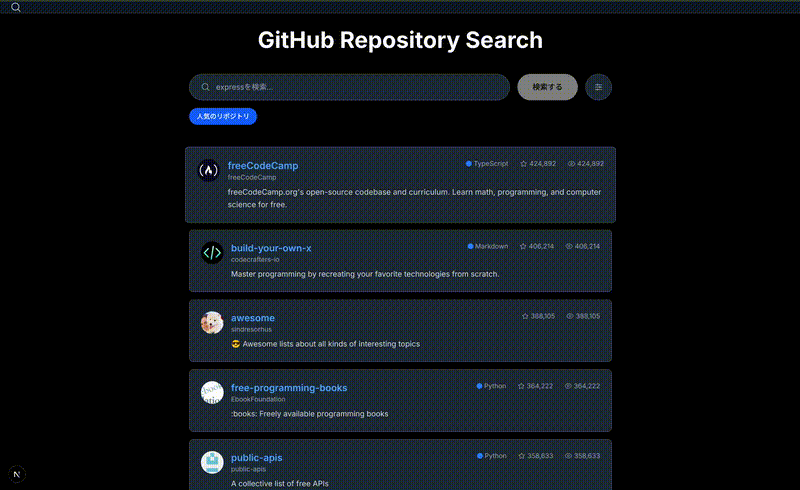

# GitHub Repository Search

[](https://github.com/glaucus03/task-github-search/actions/workflows/ci.yml)

GitHubリポジトリを効率的に検索・探索できるモダンなWebアプリケーションです。Next.js 15とReact 19を使用し、最新のフロントエンド技術を活用して実装されています。

## デモ



_動画版: [docs/assets/demo.mp4](docs/assets/demo.mp4)_

## 機能

### 🔍 検索機能

- プログラミング言語、スター数範囲、ソート条件による詳細フィルタリング
- 技術トレンドに応じた動的な検索提案表示
- 過去の検索クエリを自動保存・再利用可能
- ワンクリック操作で人気リポジトリを検索
- ヘッダーアイコンクリックで初期状態に完全リセット

### 📊 リポジトリ情報

- 基本情報、統計、トピック、ライセンス情報の一括表示
- Markdownレンダリング対応（画像URL自動変換機能付き）
- リポジトリ名横にオーナーアバターを表示
- 使用言語の割合を視覚的にグラフで表示
- メンバー情報とアクティビティの詳細表示

### 🎨 ユーザー体験

- モバイル・タブレット・デスクトップの完全対応
- 統一されたダークテーマによる一貫したUI
- 効率的な検索結果ナビゲーション（無限スクロール）
- 自動削除対応の通知システム
- Next.js 15 App Routerによる高速初期表示

## 技術スタック

### フロントエンド

- Next.js 15.x - React フレームワーク（App Router）
- React 19.x - UIライブラリ
- TypeScript 5.x - 型安全性
- HeroUI (NextUI v2) - UIコンポーネント
- Tailwind CSS v4 - スタイリング

### 状態管理・API

- Zustand - 軽量状態管理
- SWR - データフェッチング
- GitHub REST API - リポジトリデータ取得

### 開発・テスト

- Jest + Testing Library - ユニットテスト・結合テスト
- Playwright - E2Eテスト
- ESLint - コード品質
- Prettier - コードフォーマット
- TypeScript - 型安全性とDX向上

## セットアップ

### 前提条件

- Node.js 20.x以降
- npm または yarn
- GitHub Personal Access Token（推奨）

### GitHub API Token設定

#### 1. Personal Access Tokenの取得

1. [GitHub Settings > Personal access tokens](https://github.com/settings/tokens) にアクセス
2. "Generate new token (classic)" をクリック
3. 以下のスコープを選択：
   - `public_repo` - パブリックリポジトリへの読み取り専用アクセス
   - `repo:status` - リポジトリの状態へのアクセス
4. トークンを生成し、安全な場所に保存

#### 2. 環境変数の設定

```bash
# .env.localファイルを作成
cp .env.example .env.local

# .env.localにトークンを設定
GITHUB_TOKEN=your_personal_access_token_here
```

#### 3. プロダクション環境での管理

- Vercel: Environment Variables設定でGITHUB_TOKENを追加
- Netlify: Site settings > Environment variablesでGITHUB_TOKENを追加
- Docker: 環境変数またはシークレット機能を使用
- その他のプラットフォーム: 各プラットフォームのシークレット管理機能を利用

#### トークンなしでの使用について

GitHub API Tokenを設定しない場合：

- レート制限: 1時間あたり60リクエスト（IPベース）
- Tokenありの場合: 1時間あたり5,000リクエスト（認証済み）
- 多数の検索を行う場合はトークン設定を強く推奨

### インストール

```bash
# リポジトリのクローン
git clone https://github.com/your-username/task-github-search.git
cd task-github-search

# 依存関係のインストール
npm install

# 環境変数の設定（重要）
cp .env.example .env.local
# .env.localを編集してGITHUB_TOKENを設定

# 開発サーバーの起動
npm run dev
```

アプリケーションは `http://localhost:3000` で起動します。

### 利用可能なスクリプト

```bash
# 開発サーバー起動（Turbopack有効）
npm run dev

# 本番ビルド
npm run build

# 本番サーバー起動
npm start

# リンター実行
npm run lint

# テスト実行
npm run test

# テスト（ウォッチモード）
npm run test:watch

# テストカバレッジ
npm run test:coverage

# E2Eテスト実行
npm run test:e2e

# E2EテストUI
npm run test:e2e:ui
```

## プロジェクト構造

```
src/
├── app/                    # Next.js App Router
│   ├── page.tsx           # ホーム画面（検索）
│   ├── repository/        # リポジトリ詳細画面
│   │   └── [owner]/
│   │       └── [name]/
│   │           └── page.tsx
│   ├── api/               # API ルート
│   │   └── repositories/
│   ├── globals.css        # グローバルスタイル
│   ├── layout.tsx         # ルートレイアウト
│   └── providers.tsx      # プロバイダー設定
├── components/            # UIコンポーネント
│   ├── __tests__/         # コンポーネントテスト
│   ├── MarkdownPreview/   # Markdownレンダラー
│   ├── SEO/              # SEO関連コンポーネント
│   └── index.ts          # エクスポート
├── hooks/                # カスタムフック
│   ├── __tests__/        # フックテスト
│   └── useRepositorySearch.ts
├── lib/                  # ユーティリティ・設定
│   ├── constants.ts      # 定数定義
│   ├── search-domain.ts  # 検索ロジック
│   ├── storage.ts        # ローカルストレージ
│   └── utils.ts          # ユーティリティ関数
├── store/                # 状態管理（Zustand）
│   ├── __tests__/        # ストアテスト
│   ├── searchStore.ts    # 検索状態
│   └── uiStore.ts        # UI状態
└── types/                # TypeScript型定義
    ├── github.ts         # GitHub API型
    └── index.ts          # 共通型
```

## 開発における工夫・こだわりポイント

### ユーザー体験の向上

実際に使う人の立場に立って、毎日使いたくなるアプリケーションを心がけました。

検索からリポジトリ詳細まで、迷うことなく操作できるシンプルなUI設計を重視しています。モバイル・タブレット・デスクトップすべてで最適な表示を実現し、検索中やページ遷移時には適切なフィードバックを表示します。また、API エラーやネットワーク問題が発生した際も、ユーザーが次に何をすべきかが分かるよう丁寧に対応しています。

入力中の検索結果数をリアルタイムで表示する機能も、使っていて楽しくなる体験を目指して実装しました。

### 技術選択の背景

長期間運用できるアプリケーションを構築するため、技術選択には特にこだわりました。

Next.js 15 App Router、React 19 などの最新安定版を採用し、将来性と安定性のバランスを重視しています。TypeScript を活用してGitHub API レスポンスの厳密な型定義を行い、開発時の安全性を確保しました。

コンポーネントの適切なメモ化とバンドルサイズの最適化により、パフォーマンスの向上を図っています。ESLint、Prettier、包括的なテストにより、チーム開発でも品質を維持できる仕組みを整えました。

### 実装で大切にしたこと

実際のプロダクション環境での運用を見据えて設計・実装を行いました。

明確なディレクトリ構造と再利用可能なコンポーネント設計により、保守性を確保しています。新機能追加時に影響範囲を最小限に抑える設計を心がけ、ユニットテスト・E2E テストが書きやすい構造にしました。

GitHub API のレート制限を考慮した設計とトークン認証、Zustand + SWRによる効率的なクライアント状態管理も重要なポイントです。構造化データ、メタデータ、OGP設定によるSEO対応、ARIA属性とキーボードナビゲーション対応によるアクセシビリティの向上にも取り組んでいます。

## セキュリティとパフォーマンス

### API トークン管理

- 環境変数を使用した安全なトークン管理
- プロダクション環境でのシークレット管理のベストプラクティスに従った実装
- レート制限の緩和による検索体験の向上

### パフォーマンス最適化

実際の利用シーンを想定して、体感速度の向上に取り組みました。

SWRによる効率的なデータキャッシュにより、重複リクエストを排除してリアルタイムデータ同期を実現しています。無限スクロール実装では大量データの効率的な表示とメモリ使用量の最適化を行い、適切なローディング状態管理としてSuspense境界とスケルトンローダーを活用しています。

GitHub API画像の自動プロキシとサイズ最適化、ツリーシェイキングとコード分割によるバンドルサイズ最適化も重要な改善ポイントです。

## AI 利用レポート

### Claude Code を活用した開発プロセス

#### 初期設計段階

プロジェクト開始時、Claude Code を使用してkiro風の詳細な設計書を作成しました。

- 技術仕様書の生成: アーキテクチャ、コンポーネント設計、API設計を包括的にドキュメント化
- プロジェクト構造の提案: Next.js 15 App Router に最適化されたディレクトリ構成の設計
- 技術選定の根拠: 各ライブラリ・フレームワークの選定理由を明文化

#### たたき台の作成

設計書をベースに、Claude Code でアプリケーションの基本構造を生成。

- ボイラープレートコードの生成: TypeScript型定義、基本コンポーネント、設定ファイル
- GitHub API統合: 検索・詳細取得のための基本的なAPI呼び出し実装
- 状態管理の骨格: Zustand ストアの基本構造とSWRとの連携

#### 自主的なブラッシュアップ

たたき台完成後は、実際の使用感を重視して独自に改良。

テスト戦略の再設計

- Claude Code が提案したテスト構造を基に、実際のコンポーネント特性に合わせてテストケースを見直し
- E2E テストでは、ユーザーの実際の操作フローに基づいたシナリオを独自に設計
- Jest 設定を調整し、GitHub API のモック戦略を最適化

データフローの最適化

- 初期実装では単純なstate管理だったものを、ユーザビリティを考慮してページネーション対応に改良
- 検索履歴機能の実装では、LocalStorageとの連携パターンを独自に設計
- エラーハンドリングを強化し、GitHub API のレート制限を考慮した再試行機能を追加

UX/UIの改善

- 設計書通りの基本UIから、実際の操作性を検証してナビゲーション体験を改善
- ローディング状態の表示タイミング、エラーメッセージの内容を実用性重視で調整
- レスポンシブ対応では、実機でのテストを重ねてブレークポイントを最適化
- ダークモード統一による一貫したユーザー体験の実現
